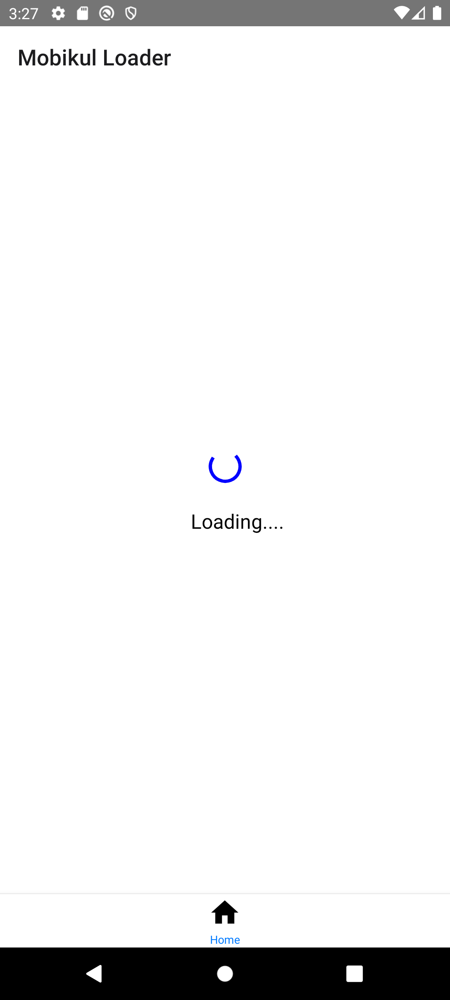

# Mobikul 
Mobikul is a leading mobile app development company that delivers innovative and high-quality mobile applications across various industries. Discover more at https://webkul.com/react-native-app-development-services/ and bring your app ideas to life with us.


## Mobikul Loader
A quick way to show a loader with message.

### Features
A simple and effective widget that shows circular progress indicator along with a message, on the current screen itself.

You can customize the message of the circular progress indicator. 

### Getting started

Add the latest version of package to your package.json (and run`npm install`):

```package.json
dependencies:
 "react-native": "1.0.2"
```

### Usage

```react-native
import { MobikulLoader } from 'mobikul-loader';
```

After importing the above line in your code, you can use the loader just like you use any other widget.

Usage - 1 --> Showing only Circular Progress indicator in a dialog
```react-native
<MobikulLoader loading={true} />
```

Usage - 2 --> Showing Circular Progress indicator with a message

```react-native
<MobikulLoader title="Loading..." loading={true} />
```

